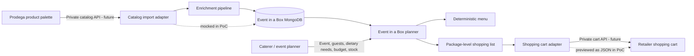
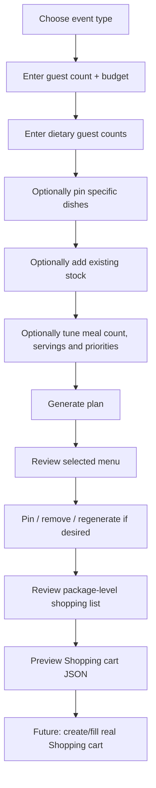
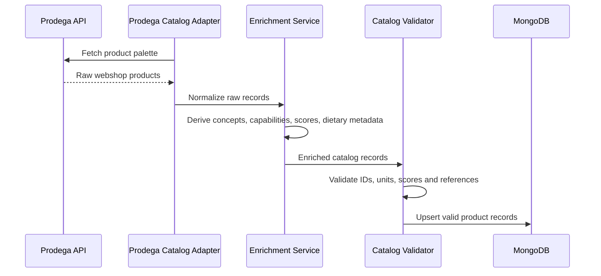
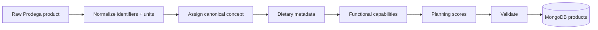
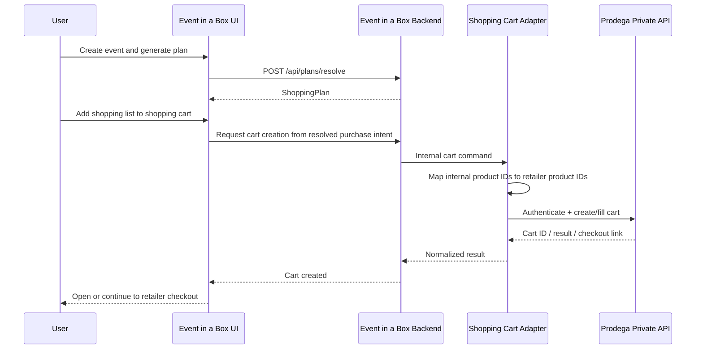
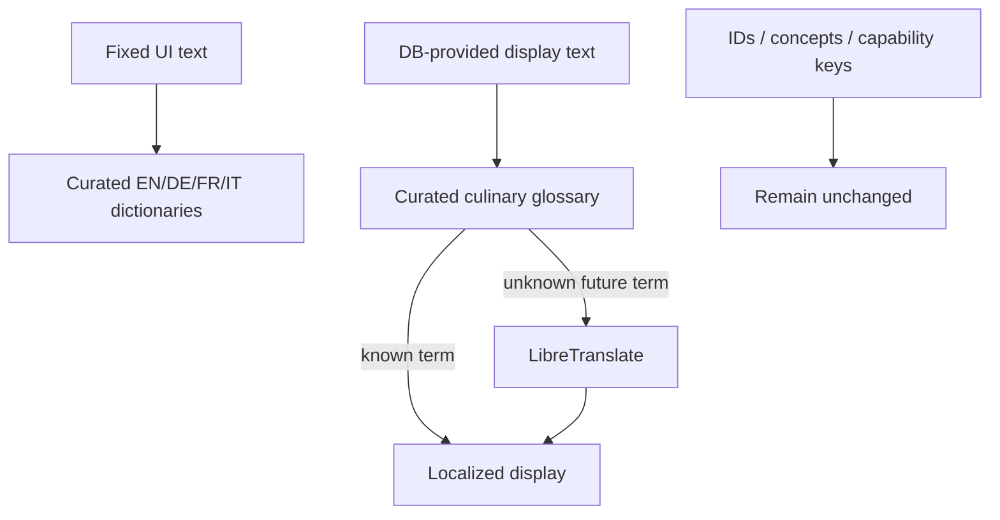
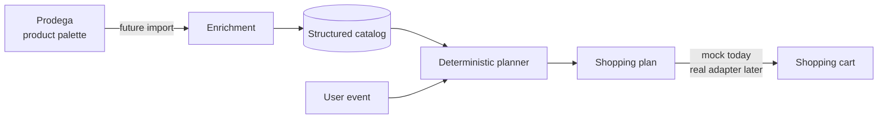

# Event in a Box

**Deterministic event catering planning from guest count to purchasable package list.**

Event in a Box is a proof of concept for turning a caterer's event requirements into an explainable menu and shopping list. The system combines reusable event templates, recipes, a purchasable product catalog, dietary requirements, existing stock, budget and configurable planning priorities. It then resolves the request deterministically and returns exact package quantities and costs.

The long-term integration story is deliberately simple:

> **Prodega owns the product palette → Event in a Box enriches and plans against that palette → the user configures an event → Event in a Box calculates what must be purchased → the resulting product references and package counts become a retailer-neutral shopping-cart handoff.**

The real Prodega API is private and is therefore **not called by this PoC**. Inbound catalog synchronization and the outbound shopping-cart handoff are represented as explicit integration boundaries and mocked where needed. We do not guess private endpoint names, authentication schemes, or request formats.

---

## Contents

- [1. The idea](#1-the-idea)
- [2. End-to-end product story](#2-end-to-end-product-story)
- [3. What the PoC already does](#3-what-the-poc-already-does)
- [4. Architecture](#4-architecture)
- [5. Run the stack](#5-run-the-stack)
- [6. User workflow](#6-user-workflow)
- [7. Data model](#7-data-model)
- [8. How data enters Event in a Box](#8-how-data-enters-event-in-a-box)
- [9. Catalog enrichment](#9-catalog-enrichment)
- [10. How planning works](#10-how-planning-works)
- [11. Dietary requirements and guaranteed dishes](#11-dietary-requirements-and-guaranteed-dishes)
- [12. Existing inventory](#12-existing-inventory)
- [13. How data leaves Event in a Box](#13-how-data-leaves-event-in-a-box)
- [14. Mock shopping cart handoff](#14-mock-shopping-cart-handoff)
- [15. Localization](#15-localization)
- [16. REST API](#16-rest-api)
- [17. Adding and changing catalog data](#17-adding-and-changing-catalog-data)
- [18. Seed validation](#18-seed-validation)
- [19. Tests](#19-tests)
- [20. Determinism and explainability](#20-determinism-and-explainability)
- [21. Production integration roadmap](#21-production-integration-roadmap)
- [22. Important PoC boundaries](#22-important-poc-boundaries)

---

# 1. The idea

A caterer should not have to manually calculate every ingredient, package size and product alternative for every event.

Event in a Box asks for the information that actually describes the event:

- event format,
- guest count,
- budget,
- dietary guest counts,
- optional guaranteed dishes,
- existing stock,
- desired number of dishes,
- servings per guest,
- and planning priorities such as price, Swiss origin, presentation, preparation ease and sustainability.

The application resolves these inputs against a structured catalog and produces:

- a selected menu,
- servings per selected dish,
- dietary coverage,
- ingredient requirements,
- stock usage,
- purchasable products,
- whole package counts,
- overbuy quantities,
- total price,
- price per guest,
- warnings,
- and an explanation of how requirements were fulfilled.

The planner is deterministic: with the same request and the same catalog, it returns the same selection.

---

# 2. End-to-end product story

The intended business flow is:



The value of Event in a Box sits between the webshop catalog and the customer's event:

```text
PRODUCT PALETTE                     DECISION ENGINE                     PURCHASE

Prodega products                   Event in a Box                      Shopping cart
      │                                  │                                  ▲
      │ catalog sync                     │                                  │ cart payload
      ▼                                  ▼                                  │
raw products ──► enrichment ──► recipes + planning ──► shopping list ──────┘
                                         ▲
                                         │
                                  event requirements
                                         ▲
                                         │
                                       user
```

Event in a Box does **not** need to become a webshop. It needs to understand the webshop's products well enough to choose the right ones and hand the final purchase intent back.

---

# 3. What the PoC already does

The current demo includes:

- Kotlin + Spring Boot backend.
- MongoDB catalog.
- Vanilla HTML/CSS/JavaScript frontend served by nginx.
- Docker Compose environment.
- Six event templates.
- Thirty-three recipes/meals.
- Thirty-six purchasable mock products.
- Five configurable planning priorities.
- Six dietary requirement types.
- Seven meal categories.
- Mobile-friendly visual event selection.
- Searchable and filterable guaranteed-dish picker.
- Searchable existing-stock picker using real product concepts instead of free text.
- Dynamic dietary guest counts.
- Dietary warnings for pinned/guaranteed dishes that do not cover an active dietary requirement.
- Deterministic menu selection.
- Pin/remove/regenerate menu workflow.
- Package-level shopping list.
- Existing-stock deduction.
- Cost and budget calculation.
- Explainable score components and requirement trace.
- EN / DE / FR / IT localization.
- Localized catalog search.
- Self-hosted LibreTranslate integration for dynamic future catalog content.
- Curated culinary translations for the current demonstration catalog.
- Developer/catalog browser hidden behind a secondary section.
- **Mock Shopping cart JSON preview** generated from the final shopping list.

---

# 4. Architecture

## Runtime architecture

```mermaid
flowchart TB
    Browser[Browser / mobile UI]
    Nginx[Frontend container\nnginx + HTML/CSS/JS]
    Backend[Backend container\nKotlin + Spring Boot]
    Mongo[(MongoDB)]
    LT[LibreTranslate\nlocalization service]
    Prodega[(Prodega private API\nnot connected in PoC)]

    Browser --> Nginx
    Nginx -->|/api/* proxy| Backend
    Backend --> Mongo
    Backend -->|dynamic translations| LT

    Prodega -. future inbound catalog sync .-> Backend
    Backend -. future outbound cart creation .-> Prodega
```



## Responsibility boundaries

| Component | Responsibility |
|---|---|
| Frontend | Event configuration, catalog pickers, warnings, result presentation, mock shopping-cart payload preview |
| Spring Boot backend | Catalog API, planning orchestration, deterministic resolver, localized search, translation proxy |
| MongoDB | Templates, meals, products and planning metadata |
| LibreTranslate | Best-effort translation for future DB-provided display text |
| Retail integration adapter | **Future:** authenticate to the configured retailer, import products, map external IDs, create/fill a shopping cart |

A key design rule is that the planner does **not** query the live webshop while resolving a plan. Planning happens against the synchronized local catalog. That keeps the algorithm fast, testable and deterministic.

---

# 5. Run the stack

## Full stack with localization

The current frontend expects the localization endpoints, so use both Compose files:

```bash
sudo docker compose \
  -f docker-compose.yml \
  -f docker-compose.localization.yml \
  up --build -d
```

Open:

```text
http://localhost:3000
```

Backend:

```text
http://localhost:8080
```

Check all containers:

```bash
sudo docker compose \
  -f docker-compose.yml \
  -f docker-compose.localization.yml \
  ps
```

Follow logs:

```bash
sudo docker compose \
  -f docker-compose.yml \
  -f docker-compose.localization.yml \
  logs -f
```

Check localization readiness:

```bash
curl http://localhost:8080/api/i18n/status
```

## Clean rebuild

```bash
sudo docker compose \
  -f docker-compose.yml \
  -f docker-compose.localization.yml \
  down

sudo docker compose \
  -f docker-compose.yml \
  -f docker-compose.localization.yml \
  build --no-cache

sudo docker compose \
  -f docker-compose.yml \
  -f docker-compose.localization.yml \
  up -d
```

## Completely fresh database

Only use this when you intentionally want to remove MongoDB data and recreate it from the seed:

```bash
sudo docker compose \
  -f docker-compose.yml \
  -f docker-compose.localization.yml \
  down -v
```

Then start the stack again.

---

# 6. User workflow



## Event type

Event formats are loaded from `eventTemplates` and shown as visual cards rather than a mobile-unfriendly dropdown. Event icons are presentation metadata and can be stored with the template.

Current examples include:

- Business Apéro
- Brunch
- Coffee Break
- Team Lunch Buffet
- Vegan Reception
- Swiss Breakfast

## Dietary guest counts

The user enters **how many guests need compatible servings**, for example:

```text
Vegetarian      12 guests
Vegan            4 guests
Halal            6 guests
Gluten-free      3 guests
Lactose-free     5 guests
Nut-free         2 guests
```

These are converted into dietary shares of the total guest count and passed to the deterministic planner.

A meal can satisfy several dietary needs at once.

## Guaranteed dishes

A user may pin a specific recipe so that it remains in the menu. If that recipe does not satisfy an active dietary requirement, the application does not silently remove it. Instead it:

1. keeps the explicitly requested dish,
2. highlights the incompatibility before generation,
3. returns structured conflict metadata after generation,
4. allocates compatible servings using other selected dishes where possible.

## Existing stock

Existing inventory is selected from catalog-backed ingredient concepts. This prevents misspellings and prevents localization from changing the internal value the resolver expects.

Example:

```text
Displayed in German:     Mozzarella
Internal concept:        mozzarella
Resolver receives:       mozzarella
```

---

# 7. Data model

MongoDB currently contains these main collections:

```text
eventTemplates
meals
products
planningPriorities
dietaryConstraints
mealCategories
```

## `eventTemplates`

Defines the type of event and its normal requirements.

Typical fields:

```json
{
  "id": "business-apero",
  "name": "Business Apéro",
  "description": "Finger food and drinks for a casual business event.",
  "icon": "🥂",
  "defaults": {
    "durationMinutes": 120,
    "mealCount": 5
  },
  "requirements": [],
  "weights": {
    "price": 0.3,
    "swiss": 0.2,
    "presentation": 0.2,
    "prepEase": 0.15,
    "sustainability": 0.15
  }
}
```

## `meals`

Meals are recipes the resolver can select.

Important fields:

```text
id
name
categoryIds
capabilities
dietaryCapabilities
serving
ingredients
scores
```

The two capability families are intentionally separate:

### Event/menu capabilities

Examples:

```text
savory
sweet
finger-food
warm
cold
apero
reception
breakfast
brunch
coffee-break
lunch
buffet
prepare-ahead
```

These describe *what the dish is useful for*.

### Dietary capabilities

Examples:

```text
vegetarian
vegan
halal
gluten-free
lactose-free
nut-free
```

These describe *which dietary serving groups the dish can cover*.

## `products`

Products are purchasable packages.

Typical shape:

```json
{
  "id": "mozzarella-1kg",
  "sku": "MOCK-001",
  "name": "Swiss Mozzarella 1 kg",
  "concept": "mozzarella",
  "originCountry": "CH",
  "package": {
    "amount": 1000,
    "unit": "g"
  },
  "price": {
    "amount": 9.8,
    "currency": "CHF"
  },
  "capabilities": [],
  "dietaryCapabilities": [
    "vegetarian",
    "gluten-free",
    "nut-free"
  ],
  "scores": {
    "price": 0.8,
    "swiss": 1,
    "presentation": 0.5,
    "prepEase": 1,
    "sustainability": 0.7
  }
}
```

### `concept` is important

Recipes reference ingredient **concepts**, not a specific package SKU.

For example:

```text
Recipe ingredient concept: mozzarella
                           │
                           ▼
Candidate purchasable products with concept = mozzarella
                           │
                           ▼
Planner scores valid products and selects one package product
```

This allows the product palette to change without rewriting recipes every time a particular package changes.

## `planningPriorities`

Defines score dimensions and their UI metadata.

Current dimensions:

- affordability / `price`
- Swiss origin / `swiss`
- presentation
- preparation ease / `prepEase`
- sustainability

The planner merges database defaults, event-template defaults and user overrides, then normalizes the final weights.

## `dietaryConstraints`

Maps a user-facing dietary option to its canonical `dietaryCapability`.

The frontend does not maintain a fixed list. New database values can be exposed dynamically.

## `mealCategories`

Browse metadata used in the guaranteed-dish picker.

Current categories include fruit, bakery, meat, plant-based, breakfast, lunch and reception.

---

# 8. How data enters Event in a Box

Today the PoC is seeded from `mongo/seed.js`.

The intended production data source is the Prodega product catalog.

## Future inbound pipeline



Because the API contract is private, **the first two arrows are mocked today**.

The rest of the model is already represented by the seeded MongoDB data.

## Example raw upstream product

The real shape is unknown. Conceptually an upstream adapter might receive something like:

```json
{
  "externalProductId": "PRODEGA-ID-FROM-PRIVATE-API",
  "sku": "123456",
  "name": "Mozzarella 1 kg",
  "price": 9.8,
  "currency": "CHF",
  "packageAmount": 1000,
  "packageUnit": "g"
}
```

This example is **illustrative only**, not a claim about the real Prodega schema.

The adapter would convert it to the internal product model used by the planner.

---

# 9. Catalog enrichment

A webshop catalog normally does not contain every planning attribute Event in a Box needs.

For example, a raw product may know its:

- product ID,
- name,
- SKU,
- package size,
- price,
- and perhaps product taxonomy.

The planner additionally benefits from:

- normalized ingredient `concept`,
- event/product capabilities,
- dietary capabilities,
- origin,
- unit/conversion metadata,
- planning scores.

Therefore a production import needs an enrichment stage.



## Possible enrichment sources

The enrichment stage can combine several approaches:

1. **Direct mapping** from trusted webshop fields.
2. **Rules** based on existing categories/taxonomy.
3. **Curated mappings** for important product families.
4. **AI-assisted enrichment** for ambiguous names/descriptions.
5. **Human review** for low-confidence records.

AI can help prepare catalog metadata, but **AI is not used to make the final planning decision**. The resolver consumes the resulting structured fields deterministically.

## Recommended enrichment contract

A useful production enrichment result would contain at least:

```json
{
  "id": "stable-internal-id",
  "sku": "external-or-retailer-sku",
  "name": "Human-readable product name",
  "concept": "canonical-ingredient-concept",
  "package": {
    "amount": 1000,
    "unit": "g"
  },
  "price": {
    "amount": 9.8,
    "currency": "CHF"
  },
  "originCountry": "CH",
  "capabilities": [],
  "dietaryCapabilities": [],
  "scores": {
    "price": 0.8,
    "swiss": 1,
    "presentation": 0.5,
    "prepEase": 1,
    "sustainability": 0.7
  }
}
```

When Prodega's real identifiers are known, the recommended extension is to keep them explicitly, for example:

```json
{
  "externalIds": {
    "prodega": {
      "productId": "..."
    }
  }
}
```

That field is intentionally **not invented in the current PoC database schema** because the private contract is not available yet.

---

# 10. How planning works

At a high level:

```text
1. Load selected event template
2. Load current catalog and planning metadata
3. Merge template defaults with user overrides
4. Resolve requested dietary shares
5. Resolve required and excluded meal IDs
6. Find meals compatible with event requirements
7. Apply hard constraints before scoring
8. Prefer candidates that improve requested dietary coverage
9. Score remaining valid candidates deterministically
10. Allocate exact servings across selected meals
11. Expand recipes into ingredient quantities
12. Aggregate identical ingredient concepts
13. Select purchasable products for each requirement
14. Deduct compatible existing inventory
15. Round remaining demand up to whole packages
16. Calculate overbuy and cost
17. Return menu, shopping list, totals, warnings and trace
```

## Selection score

Candidate scores are normalized so that:

```text
1.0 = desirable
0.0 = undesirable
```

A weighted score is conceptually:

```text
finalScore =
    priceScore          × priceWeight
  + swissScore          × swissWeight
  + presentationScore   × presentationWeight
  + prepEaseScore       × prepEaseWeight
  + sustainabilityScore × sustainabilityWeight
```

The exact effective weights are normalized before use.

Stable IDs are used as deterministic tie-breakers.

---

# 11. Dietary requirements and guaranteed dishes

Dietary requirements in the current application are **coverage requirements**, not a rule that every dish in the menu must satisfy every selected diet.

Example:

```text
40 guests
10 vegetarian
 4 vegan
 3 gluten-free
```

The planner calculates minimum compatible servings for those groups across the selected menu.

## Pinned dish warning

A user can intentionally pin a dish that does not cover one or more dietary groups.

Example:

```text
Vegan guests: 6
Pinned dish: Mini Ham Croissants
```

The ham dish is still allowed because it was explicitly requested, but Event in a Box reports that it does not cover the vegan requirement. Other meals must provide the vegan allocation.

This behavior is dynamic: warnings are based on the configured dietary definitions and each meal's `dietaryCapabilities`, not a hardcoded vegan/vegetarian list.

---

# 12. Existing inventory

Stock is applied **before package rounding**.

Example:

```text
Required mozzarella:     2.6 kg
Existing stock:           0.8 kg
Net purchase requirement: 1.8 kg
Available package:        1.0 kg
Packages to buy:          2
Purchased quantity:       2.0 kg
Overbuy:                  0.2 kg
```

Supported unit families include mass, volume, count, cups, bottles and servings. Compatible units are normalized internally.

---

# 13. How data leaves Event in a Box

The primary planning response is a `ShoppingPlan` JSON object.

It contains:

```text
event
selectedMeals
constraintConflicts
fulfilledRequirements
ingredientRequirements
shoppingItems
usedExistingInventory
unusedExistingInventory
totals
warnings
```

The most important field for an eventual webshop handoff is `shoppingItems`.

Each shopping item already contains:

```text
productId
sku
name
concept
packageSize
packageCount
requiredQuantity
inventoryUsed
netRequiredQuantity
purchasedQuantity
overbuyQuantity
unitPrice
lineTotal
```

This means the planner's output already contains the essential purchase intent:

> **which purchasable catalog item, and how many packages.**

---

# 14. Mock shopping cart handoff

After generating a plan, the Shopping List section now contains:

> **Preview shopping cart JSON**

The button opens a dialog showing the mock payload derived from the current plan.

Only products with `packageCount > 0` are included.

## Example mock payload

```json
{
  "schemaVersion": "1.0",
  "integration": "shopping-cart",
  "mode": "MOCK",
  "cartIntent": "CREATE_OR_UPDATE_CART",
  "event": {
    "templateId": "business-apero",
    "guestCount": 40,
    "budget": {
      "amount": 800,
      "currency": "CHF"
    }
  },
  "items": [
    {
      "eventInABoxProductId": "mozzarella-1kg",
      "sku": "MOCK-001",
      "packageCount": 2
    },
    {
      "eventInABoxProductId": "mineral-water-6x15",
      "sku": "MOCK-020",
      "packageCount": 3
    }
  ],
  "totals": {
    "packageLines": 2,
    "packages": 5,
    "plannedCost": {
      "amount": 46.3,
      "currency": "CHF"
    }
  },
  "integrationNote": "Mock contract only. A retailer-specific adapter must map Event in a Box product IDs/SKUs to external webshop product identifiers and the real cart API."
}
```

The exact values depend on the generated plan.

## What the mock button does

The dialog provides:

- a JSON preview,
- **Copy JSON**,
- **Simulate cart handoff**.

`Simulate cart handoff` does **not** perform a network call. It makes the future retailer-neutral handoff visible during the demo and logs the same payload to the browser console.

## Future real outbound flow

The production version should move the final handoff behind a backend integration adapter:



### Why the real call belongs in the backend

Retailer API credentials must never be embedded in browser JavaScript.

The backend adapter should own:

- credentials,
- authentication/token refresh,
- external product-ID mapping,
- request retries,
- error normalization,
- cart creation/update,
- audit logging,
- and any retailer-specific API details.

The frontend should only say, conceptually:

```text
"Create a webshop cart from this resolved shopping list."
```

---

# 15. Localization

The UI supports:

```text
EN
DE
FR
IT
```

English is the default.

Localization is intentionally separated from MongoDB and from planner identifiers.

## Localization layers



Examples:

```text
Displayed:       Rührei
Catalog meal ID: scrambled-eggs

Displayed:       Cherrytomaten
Concept:         cherry-tomato
```

Translated text is presentation-only. The planner continues to receive stable original identifiers.

## Localized search

The meal and inventory pickers search using the selected language as well as catalog terminology.

The current demonstration includes curated culinary aliases for important terms, while unknown future terms can fall back to automatic translation.

For example, German searches such as:

```text
Rührei
Rösti
Räucherlachs
herzhaft
Apfel
Wasser
```

can still match an English-source catalog.

## Translation failure behavior

Translation is an enhancement, never a planner dependency.

If LibreTranslate is unavailable:

- the application still loads,
- English/source database text remains visible,
- planning continues to work,
- translation can retry later.

---

# 16. REST API

## Catalog

```text
GET /api/templates
GET /api/templates/{id}
GET /api/meals
GET /api/meals/search
GET /api/meal-categories
GET /api/meal-capabilities
GET /api/dietary-constraints
GET /api/products
GET /api/inventory-concepts/search
GET /api/priorities
```

## Planning

```text
POST /api/plans/resolve
```

Example:

```bash
curl -X POST http://localhost:8080/api/plans/resolve \
  -H 'Content-Type: application/json' \
  -d '{
    "templateId": "business-apero",
    "guestCount": 40,
    "budget": 800,
    "servingsPerGuest": 4,
    "mealCount": 5,
    "dietaryShares": {
      "vegetarian": 0.25,
      "vegan": 0.10,
      "gluten-free": 0.05
    },
    "requiredMealIds": ["caprese-skewers"],
    "weights": {
      "price": 0.30,
      "swiss": 0.20,
      "presentation": 0.20,
      "prepEase": 0.15,
      "sustainability": 0.15
    },
    "availableInventory": [
      {
        "concept": "mozzarella",
        "amount": 500,
        "unit": "g"
      }
    ]
  }'
```

## Localization

```text
GET  /api/i18n/status
POST /api/i18n/translate
GET  /api/i18n/meals/search
GET  /api/i18n/inventory-concepts/search
```

The localized search endpoints are UI conveniences. Stable catalog IDs remain unchanged.

---

# 17. Adding and changing catalog data

For the PoC, catalog data is maintained in:

```text
mongo/seed.js
```

The seed is idempotent and uses upserts by stable `id`.

## Adding a new product

A new product should have:

- unique `id`,
- unique `sku`,
- human-readable `name`,
- canonical `concept`,
- positive package amount,
- package unit,
- price,
- currency,
- functional capabilities where relevant,
- dietary capabilities where relevant,
- planning scores,
- optional conversion metadata.

Then ensure recipes can reference its `concept`.

### Product example

```js
{
  id: "example-tomatoes-1kg",
  sku: "MOCK-999",
  name: "Example Tomatoes 1 kg",
  concept: "tomato",
  originCountry: "CH",
  package: {
    amount: 1000,
    unit: "g"
  },
  price: {
    amount: 6.50,
    currency: "CHF"
  },
  capabilities: [],
  dietaryCapabilities: [
    "vegan",
    "vegetarian",
    "halal",
    "gluten-free",
    "lactose-free",
    "nut-free"
  ],
  scores: {
    price: 0.75,
    swiss: 1,
    presentation: 0.70,
    prepEase: 0.90,
    sustainability: 0.82
  }
}
```

## Adding a new meal

A meal needs:

- unique `id`,
- name,
- one or more `categoryIds`,
- event/menu capabilities,
- dietary capabilities,
- serving information,
- ingredient concepts,
- scores.

Every ingredient concept must have at least one purchasable product candidate.

### Meal example

```js
{
  id: "tomato-breakfast-bites",
  name: "Tomato Breakfast Bites",
  categoryIds: ["breakfast", "plant-based"],
  capabilities: ["savory", "breakfast", "finger-food"],
  dietaryCapabilities: ["vegetarian", "gluten-free", "nut-free"],
  serving: {
    piecesPerServing: 2
  },
  ingredients: [
    {
      concept: "tomato",
      amountPerServing: 80,
      unit: "g"
    }
  ],
  scores: {
    price: 0.75,
    swiss: 1,
    presentation: 0.80,
    prepEase: 0.80,
    sustainability: 0.82
  }
}
```

## Adding a dietary option

Add a `dietaryConstraints` record and tag compatible meals/products using the same canonical `dietaryCapability`.

Conceptually:

```js
{
  id: "new-diet",
  label: "New diet",
  description: "Serving coverage description.",
  displayOrder: 70,
  dietaryCapability: "new-diet",
  requiredCapabilities: ["new-diet"],
  excludedCapabilities: [],
  excludedConcepts: []
}
```

The planner UI is data-driven. It does not need a new checkbox hardcoded for every future dietary value.

## Adding a meal category

Add a `mealCategories` entry and reference its ID from `meal.categoryIds`.

Optional icon metadata can be used by the visual UI.

## Adding an event template

Add an `eventTemplates` entry containing:

- stable ID,
- name,
- description,
- optional icon,
- defaults,
- meal/product requirements,
- priority weights.

The visual event selector is also data-driven.

## Applying seed changes to an existing MongoDB volume

Run the repository's reseed script:

```bash
./scripts/reseed.sh
```

Or execute the seed directly if needed:

```bash
sudo docker compose exec -T mongodb mongosh catering < mongo/seed.js
```

---

# 18. Seed validation

The seed checker is intentionally strict. It validates far more than document counts.

Run:

```bash
sudo docker compose exec -T mongodb mongosh catering < mongo/check-seed.js
```

The current check covers, among other things:

- expected catalog counts,
- required event templates,
- required dietary definitions,
- meal-category references,
- planning-priority references,
- separation of event capabilities and dietary capabilities,
- template defaults,
- required requirement candidates,
- ingredient concepts backed by products,
- Swiss-origin score consistency,
- dietary fixtures,
- Business Apéro alternative depth,
- and multiple water/product alternatives.

If seed data is changed, `check-seed.js` should be updated only when the expected catalog contract itself intentionally changes.

---

# 19. Tests

Backend tests:

```bash
cd backend
mvn test
```

The planner test suite covers behavior such as:

- target quantities,
- package rounding,
- inventory deduction,
- unit conversions,
- hard constraints,
- deterministic tie-breaking,
- servings-per-guest allocation,
- guaranteed meals,
- meal counts,
- dietary allocation,
- overlapping dietary shares,
- strict meal-like shortfalls,
- snack-plan warnings,
- planning weights,
- exclusions,
- and guaranteed-meal dietary warning metadata.

For a Docker build, backend tests run during the Maven package/build stage. A failing unit test should therefore fail the backend image build instead of silently producing an image with known regressions.

Frontend JavaScript can be syntax-checked with:

```bash
node --check frontend/app.js
node --check frontend/i18n.js
```

---

# 20. Determinism and explainability

Event in a Box deliberately separates **data enrichment** from **plan resolution**.

An upstream enrichment process may eventually use AI or heuristics to classify products. Once the catalog has been structured, however, planning itself is deterministic.

That distinction matters:

```text
Possible AI / enrichment phase
          │
          ▼
Structured, reviewable catalog
          │
          ▼
Deterministic resolver
          │
          ▼
Explainable menu and purchase quantities
```

The result can therefore expose:

- the requirements that were fulfilled,
- which meal/product fulfilled them,
- effective score components,
- applied weights,
- quantity calculations,
- inventory usage,
- package rounding,
- and warnings.

This is substantially easier to test and explain than asking a generative model to produce a shopping cart directly.

---

# 21. Production integration roadmap

The PoC deliberately stops before retailer-specific integration details. A realistic next-stage architecture would add the following.

## A. Prodega inbound adapter

Responsibilities:

```text
authenticate to Prodega
fetch product palette
normalize identifiers
normalize prices and package sizes
track availability / discontinued products
store raw import metadata
trigger enrichment
upsert catalog
```

## B. Enrichment service

Responsibilities:

```text
concept normalization
category mapping
dietary classification
functional capability classification
origin normalization
unit/conversion mapping
planning-score generation
confidence / review workflow
```

## C. External-ID mapping

The internal catalog should retain the real Prodega product identifier once known.

This mapping should be explicit, persistent and testable; it should not rely on product names.

## D. Outbound shopping-cart adapter

Responsibilities:

```text
receive resolved package purchase intent
map internal IDs to retailer product IDs
authenticate server-side
create or select cart
add/update product quantities
handle unavailable products
return cart identifier or checkout link
```

## E. Catalog freshness

A real integration needs a policy for:

- price changes,
- product removal,
- product replacement,
- package-size changes,
- availability,
- sync frequency,
- and what happens to saved event plans when the catalog changes.

## F. Operational safeguards

Before real ordering, add:

- authentication and authorization,
- secrets management,
- user/session ownership,
- audit logs,
- idempotency keys for cart writes,
- retry policy,
- API rate-limit handling,
- observability,
- and clear user confirmation before creating or changing a retailer cart.

---

# 22. Important PoC boundaries

## Mock product data

The current product catalog is seeded mock data. Prices, SKUs and product IDs are demonstration values.

## Private Prodega API

The Prodega API is not public to this project. Therefore:

- no real Prodega request is made,
- no endpoint names are guessed,
- no authentication method is guessed,
- no claim is made that the mock cart JSON matches Prodega's actual contract.

The JSON preview demonstrates **our side of the integration contract**: Event in a Box can deterministically identify the products and package quantities that need to be purchased.

Once the private API documentation is available, an adapter can translate that internal purchase intent into the retailer's actual contract.

## No automatic purchasing

The PoC does not place orders or spend money.

The **Simulate cart handoff** button is deliberately a visualization/demo action only.

---

# Summary

Event in a Box demonstrates a clean separation of responsibilities:



The retailer remains the source of purchasable products and the destination for checkout. Event in a Box provides the intelligence in between: **turning an event into an explainable, quantity-correct selection from that product palette.**
